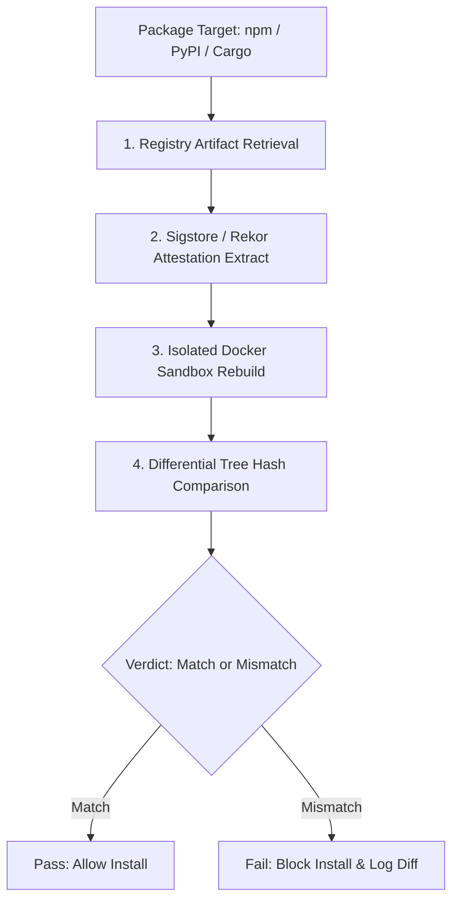

# ClearHash Verification & Architecture Specification

This document details the cryptographic attestation pipeline, container isolation guarantees, and differential tree matching algorithms implemented in ClearHash.

## Pipeline Architecture

ClearHash verifies supply-chain integrity through a five-stage pipeline:

1. **Registry Artifact Retrieval**: ClearHash downloads the package tarball from the upstream registry (npm, PyPI, or Cargo) and calculates its SHA-256 digest.
2. **Attestation Validation**: ClearHash extracts the SLSA provenance statement, checks the leaf certificate issuer against Fulcio's DN, and verifies the Rekor transparency log entry.
3. **Container Sandbox Rebuild**: ClearHash clones the attested source git repository at the exact commit SHA inside an isolated Docker container (`node:20-bookworm-slim` or equivalent), running the build command in an unprivileged sandbox.
4. **Differential Tree Hash Comparison**: ClearHash unpacks both the rebuilt tarball and the registry tarball into temporary isolated trees, normalizing file permissions and line endings.
5. **Verdict Generation**: If the file trees match, ClearHash outputs a success verdict. If any injected files, content changes, mode flips, or missing files are detected, ClearHash returns a non-zero exit code and displays the exact diff breakdown.

## Differential Classification Taxonomy

ClearHash categorizes all tree discrepancies into four distinct categories:

| Category | Description | Example |
| --- | --- | --- |
| `OnlyInRegistry` | File exists in the registry tarball but not produced by source rebuild | Injected post-build backdoor script |
| `ContentDiffers` | File exists in both trees but byte hashes differ | Modified source file or altered binary build artifact |
| `ModeDiffers` | File contents match but POSIX executable bits differ | Executable bit added to non-executable script |
| `OnlyInRebuild` | File produced by source rebuild but missing from registry tarball | Excluded source file or deleted test asset |

## Security & Sandbox Boundaries

- **Container Isolation**: Rebuild steps run in read-only container root filesystems with dropped Linux capabilities (`--cap-drop=ALL`) and non-root UID execution.
- **Offline Dependency Cache**: The sandbox environment pre-fetches lockfile dependencies verified against registry SHA-256 hashes prior to executing build scripts, preventing network side-channel modifications during compilation.
